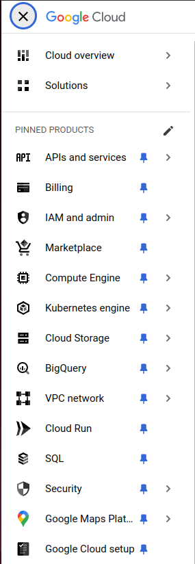
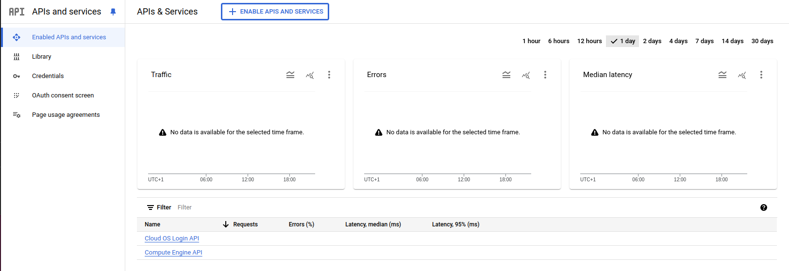
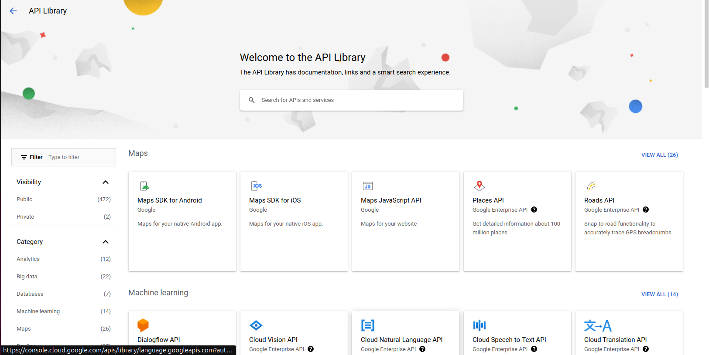
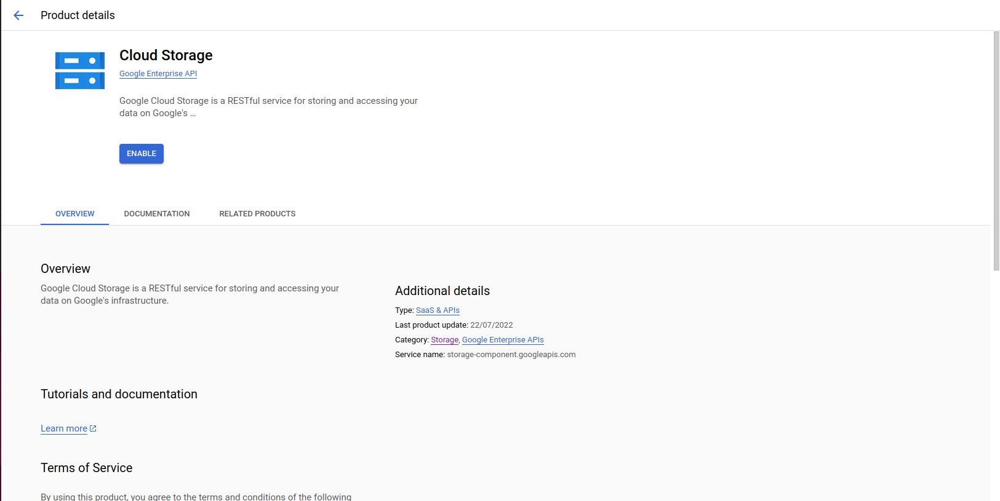

timm Project Configuration

## Overview

When creating a new project within GCP Cloud, there are a few steps that must 
be taken, in order to grant resource deployment and automation within this 
particular project.

This article sets out to describe what must be done in order to configure the
cloud environment for further uses.

## API Enabling

In order to provision resources to be created within a project, several API may
need to be enabled.
These APIs allow the technical provisioning of cloud resources by means of IaC
tools, such as `Ansible`, `Terraform`, `OpenTofu`, `Terraspace`, or even a 
custom REST-based tool.

As with every Cloud Provider, enabling APIs can be done by different means, be
it over the portal, with `gcloud` CLI tool, or even the Google provider of IaC
tools.

### Graphic Enabling

1. Within the Portal, select the project of your organization
1. On the side panel, select the product `API and services`
   
   
1. Click on the button `+ ENABLE APIS AND SERVICES`
   
1. Either (i) search for the desired resource or (ii) enter a search term 
1. Enable the API
   

### Enabling with the `gcloud` CLI

1. Log in with `gcloud`
   ```bash
   gcloud auth login
   ```
   + if you have a different default project, set your project
     ```bash
     gcloud config set project $PROJECT_ID
     ```
1. Enable the desired API
   ```bash
   gcloud services enable $SERVICE_NAME
   ```
   + (Optional) You can check for all enabled APIs with the following command:
     ```bash
     gcloud services list --enabled
     NAME                    TITLE
     compute.googleapis.com  Compute Engine API
     oslogin.googleapis.com  Cloud OS Login API
     ```
> **Note:**
>
> In the `scripts` folder, you can set up multiple service APIs at once.
> Just make sure to know which APIs you really need.

### Output

Enabled Service APIs can be checked with the following command:
```bash
$ gcloud services list --enabled

NAME                                 TITLE
compute.googleapis.com               Compute Engine API
edgecache.googleapis.com             Global Edge Cache Service
iam.googleapis.com                   Identity and Access Management (IAM) API
iamcredentials.googleapis.com        IAM Service Account Credentials API
networkmanagement.googleapis.com     Network Management API
networksecurity.googleapis.com       Network Security API
networkservices.googleapis.com       Network Services API
networksubscriptions.googleapis.com  Network Subscriptions
oslogin.googleapis.com               Cloud OS Login API
servicenetworking.googleapis.com     Service Networking API
storage-api.googleapis.com           Google Cloud Storage JSON API
storage-component.googleapis.com     Cloud Storage
storage.googleapis.com               Cloud Storage API
```


## References

- [Google Docs - Enabling an API in your Google Cloud project](https://cloud.google.com/endpoints/docs/openapi/enable-api#gcloud)
